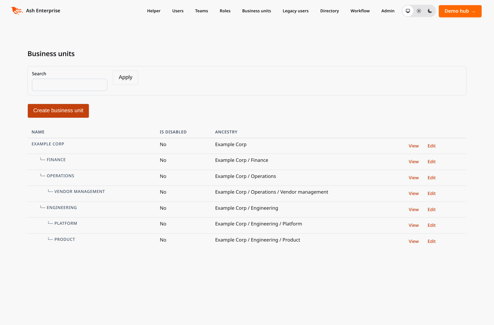
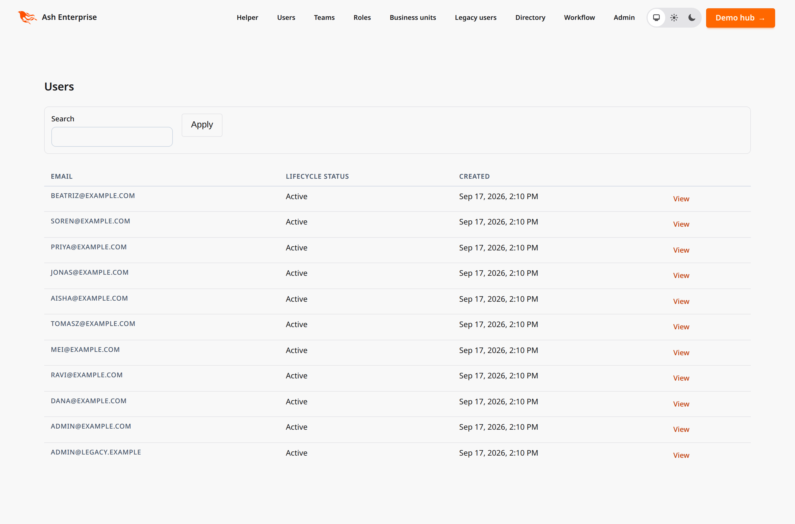
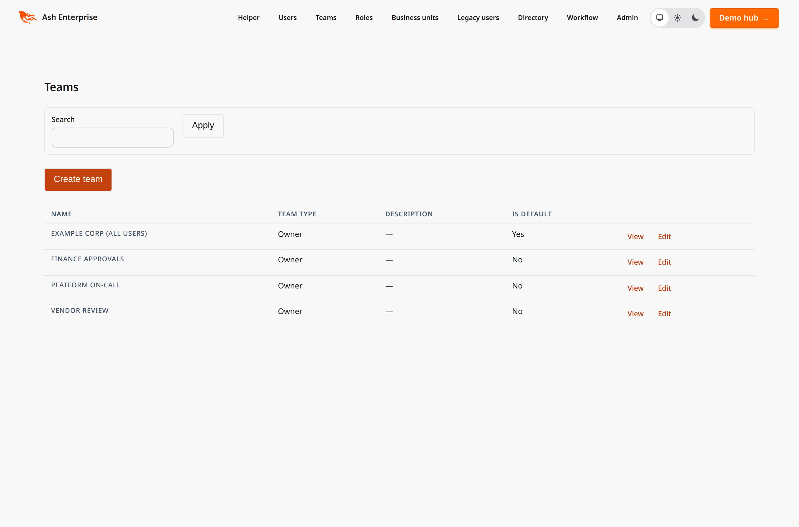
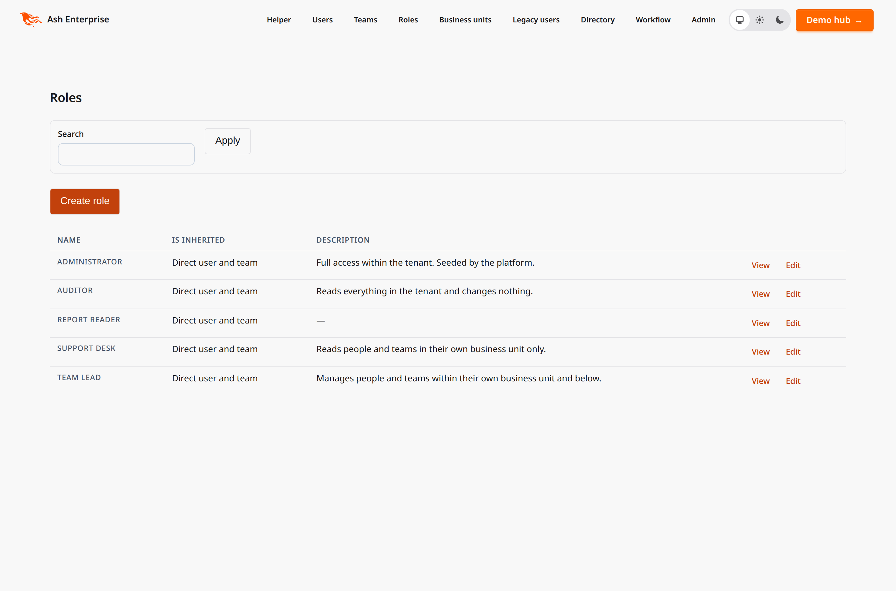
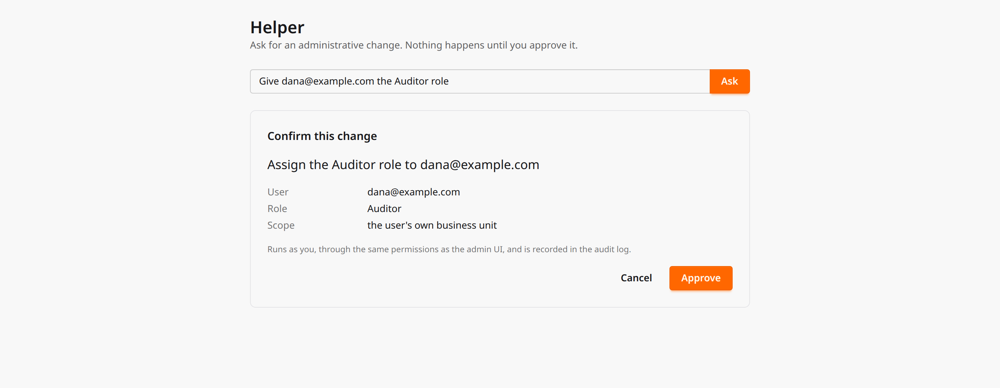
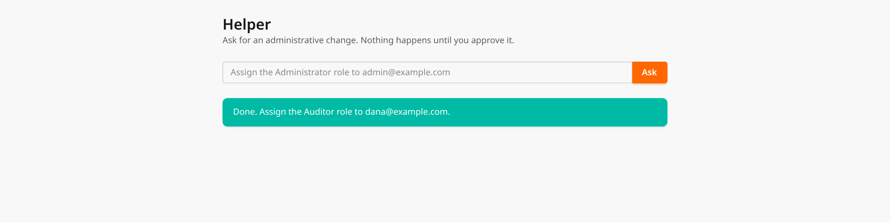
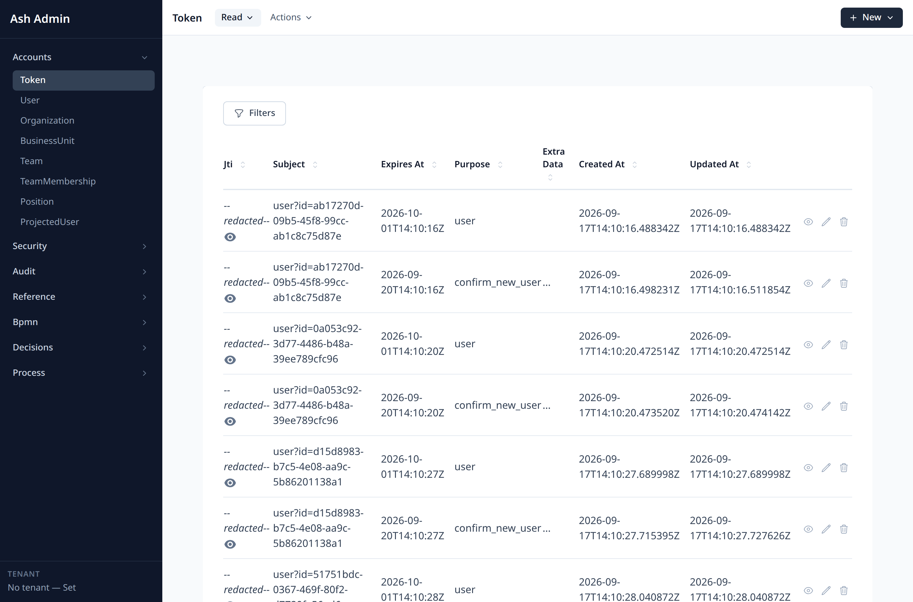
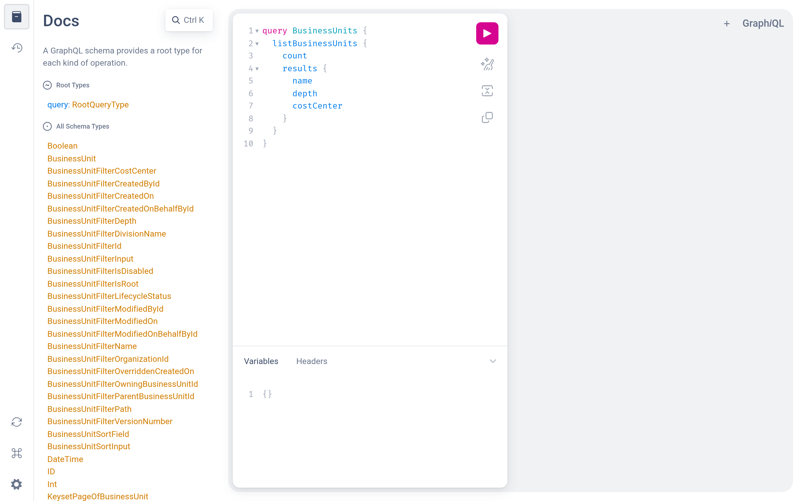

# Ash Enterprise

A reference Elixir/Ash application: a base template for enterprise software —
ERP, workflow management, line-of-business systems — with an opinionated answer
for every cross-cutting concern, and a repeatable process for growing the domain
model over time.

**The argument is in [`docs/manifesto/`](docs/manifesto/00-index.md). The code is
the evidence.** Several things here look unusual on purpose; the reasoning is
written down.

## The thesis

> The cross-cutting concerns of enterprise software are declarable. Declare them
> once, derive them everywhere, and what is left over is the actual business.

Enterprise software is not hard because any one feature is hard. It is hard
because ownership, hierarchical access control, audit, versioning, multitenancy,
lifecycle and integration surfaces cross-cut *every* entity. Written per feature,
they decay. Declared once, they cannot.

## Getting started

```bash
devenv up -d                            # Postgres (with pgvector)
devenv shell -- mix setup               # deps, database, migrations
devenv shell -- mix ash_enterprise.seed # a tenant, a role, a user
devenv shell -- iex-server              # the app
```

Sign in with the credentials the seeder prints, then visit:

| URL | What |
|---|---|
| `/agent` | Helper console — the model proposes, you approve, the app executes |
| `/app/users`, `/app/teams`, `/app/roles`, `/app/business-units` | A2UI surfaces derived from resource metadata |
| `/admin` | Zero-config admin over every resource |
| `/clarity` | ER, class, policy and state-machine diagrams (dev only) |
| `/api/json/swaggerui` · `/gql/playground` | JSON:API + OpenAPI, GraphQL |

## What it looks like

Nothing below was designed. Every surface here is derived from the same resource
definitions — which is the point: the screenshots are what you get for declaring
a resource, before writing any UI.

**A2UI surfaces.** One page per resource, rendered from resource metadata. The
list, the filter, the pagination and the create form are all derived; the actor
and the tenant are the only things the LiveView supplies, so each surface is
filtered by exactly the policies that guard the API.



The same generator, three more resources — users, teams and security roles:

| Users | Teams | Roles |
|---|---|---|
|  |  |  |

**The helper console.** Ask for an administrative change in plain language. The
model plans and returns a struct; it never holds the mutation, so there is no
tool for a prompt injection to reach.

Here it has interpreted *"Give dana@example.com the Auditor role"*. The names are
resolved **as you**, against records you are allowed to see — so a user you
cannot read comes back as "not found" rather than as a proposal referencing a
record you have no business knowing exists. Authorization is checked before this
card is rendered, so you are never asked to confirm something that will then
fail:



Approving executes it *as you*, through the same policies as the admin UI. The
audit row names the human who approved, not the model that suggested:



Interpreting a request needs a provider key. Everything after it — resolution,
authorization, execution, audit — is ordinary Ash code and does not, which is why
the flow is exercised end to end by the test suite without one.

**AshAdmin.** Every resource, every action, no configuration.



**GraphQL.** The schema — types, filter inputs, sort inputs, pagination — is
generated from the resources that opt into an `api_type`. Nothing in the list
below was hand-written.



## What is here

**A platform layer.** `AshEnterprise.Platform.Resource` is the base resource
every resource uses. Ownership, provenance, lifecycle, concurrency, tenancy,
audit, soft delete, telemetry and authorization arrive by inheritance — not by
per-resource discipline.

**Authorization as data.** A faithful implementation of the Dataverse security
model: `(role, privilege, depth)` rows evaluated as a **pure union of grants**,
with business-unit hierarchy, per-record sharing, and manager/position hierarchy.
`test/ash_enterprise/security/conformance_test.exs` is the truth table, and it is
the first thing to read when the model surprises you.

**A schema commons.** Entities derived from the Microsoft Common Data Model —
vendored at a pinned commit, resolved offline, committed as flat JSON. 43 CDM
entities plus 18 from the Dataverse table reference. Do not invent your nouns.

**Agents as first-class users.** The same Ash actions and policies back the web
UI, JSON:API, GraphQL and MCP. An LLM tool is a *declaration that an existing
action may be invoked*, not a parallel code path — which is why there is no
agent-specific authorization, and therefore no agent-specific authorization bug.

## Non-negotiables

1. Every resource uses `AshEnterprise.Platform.Resource`. Opting out is explicit
   and greppable, never silent.
2. **Never use `forbid_if` for row access.** The model is a pure union; one
   `forbid_if` reintroduces order-dependence.
3. **Policy checks never query.** Everything is precomputed once per request into
   `ActorContext`. A check that queries is a bug, not a slow path.
4. Run `mix ash.codegen` after changing a resource. Drift is a CI failure.
5. Never edit `priv/cdm/schemaDocuments/` — vendored CC-BY-4.0 content.

## Documentation

| Where | What |
|---|---|
| [`docs/HANDOFF.md`](docs/HANDOFF.md) | **Start here in a new session** — current state, findings that cost time to discover, what is genuinely not done |
| [`docs/manifesto/`](docs/manifesto/00-index.md) | The seven theses, including [what we do not have](docs/manifesto/07-what-we-do-not-have.md) |
| [`docs/adr/`](docs/adr/README.md) | Decision records, with the reversal path for each |
| [`docs/plans/`](docs/plans/) | Deferred work: strangler-fig migrations, business process modelling |
| `AGENTS.md` | Generated from dependency usage rules — do not edit the generated sections |
| `.claude/skills/` | Task-specific guidance for AI agents |

## Honest limits

Read [thesis 7](docs/manifesto/07-what-we-do-not-have.md) before committing to
this stack. In brief: no WebAuthn or SAML, no approval-workflow extension, no
Dialyzer certainty against Spark-generated code, and no retention/erasure story
for the append-only audit log. Each is named rather than glossed.

This is a template, not a product. Clone it, delete what you do not need, and
keep the shape.
