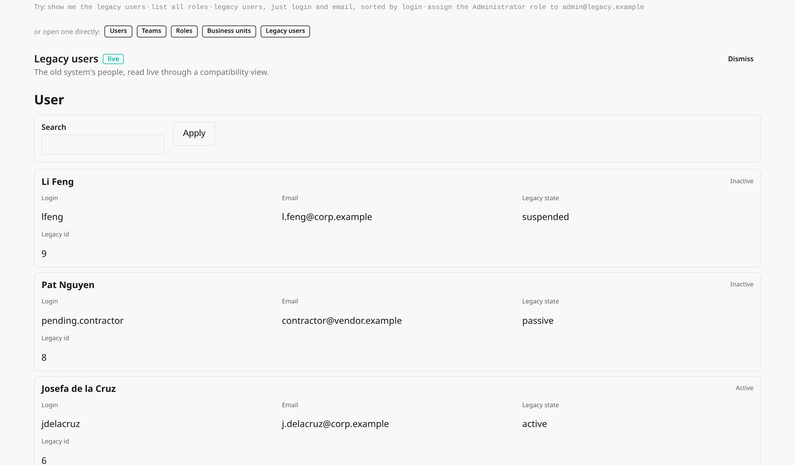
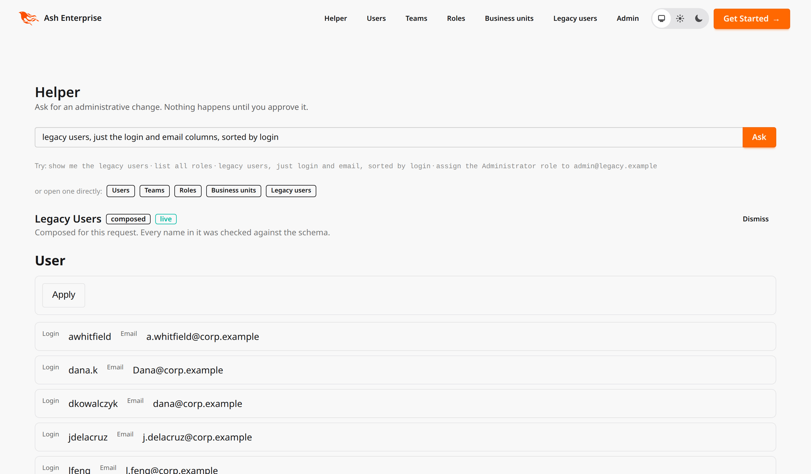
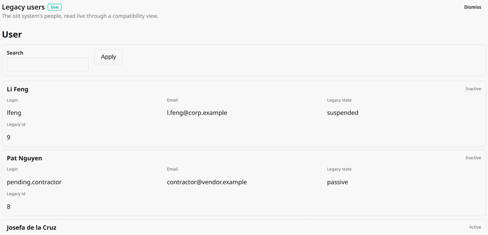

# Ash Enterprise

A reference Elixir/Ash application: a base template for enterprise software —
ERP, workflow management, line-of-business systems — with an opinionated answer
for every cross-cutting concern, and a repeatable process for growing the domain
model over time.

**The argument is in [`docs/manifesto/`](docs/manifesto/00-index.md). The code is
the evidence.** Several things here look unusual on purpose; the reasoning is
written down.

## The thesis

> The cross-cutting concerns of enterprise software are declarable. Declare them
> once, derive them everywhere, and what is left over is the actual business.

Enterprise software is not hard because any one feature is hard. It is hard
because ownership, hierarchical access control, audit, versioning, multitenancy,
lifecycle and integration surfaces cross-cut *every* entity. Written per feature,
they decay. Declared once, they cannot.

## Every enterprise application answers the same questions

Not the same features — the same *questions*. Who owns this record; who may see it; what happened to
it and can you prove it; whose tenant is it; where did the data come from; how does the contract change
without breaking the callers you cannot see. Most systems answer them one feature at a time, and find
out in month nine which answers disagree.

This is the ledger. ✅ means working code plus a test that would fail if it regressed; 🟡 means it
works with a limitation stated in the answer; 🔵 means a decision is written down and no code exists;
⚪ means a gap with no decision taken.

<!-- roadmap:scoreboard:start -->
**15 of 51** enterprise questions have a shipped answer.

✅ Shipped 15 · 🟡 Partial 13 · 🔵 Planned 8 · ⚪ Open 15
<!-- roadmap:scoreboard:end -->

<!-- roadmap:sections:start -->
| Section | Shipped | Partial | Planned | Open |
|---|---|---|---|---|
| Who are you, and what may you do? | 4 | 2 | 0 | 4 |
| What happened, and can you prove it? | 8 | 1 | 0 | 2 |
| Whose data is it? | 2 | 1 | 0 | 3 |
| Where does data come from, and where does it go? | 0 | 0 | 6 | 2 |
| How does it change, and keep running? | 1 | 6 | 2 | 1 |
| Can you prove it, continuously? | 0 | 3 | 0 | 3 |
<!-- roadmap:sections:end -->

<details>
<summary><strong>The full ledger — click to expand</strong></summary>

<!-- roadmap:questions-summary:start -->
| # | Question | Our answer | Status |
|---|---|---|---|
| 1 | How do people prove who they are? | Password, magic link, OAuth2/OIDC and API keys via `ash_authentication`. No WebAuthn and no SAML anywhere in the ecosystem — the two gaps most likely to appear in an RFP. | 🟡 Partial |
| 2 | How is "may this actor do this?" decided? | `(role, privilege, depth)` rows evaluated as a pure union of grants — authorization is data, not code. No deny rules, so order cannot matter. | ✅ Shipped |
| 29 | How do enterprise customers bring their own identity provider? | Open. AshAuthentication ships password, magic link, API key and OAuth2, and no SAML — which is still the format most enterprise IdPs lead with in a procurement conversation. OIDC is reachable through the existing OAuth2 strategy; SAML would need a new one. | ⚪ Open |
| 3 | Who owns a record? | Polymorphic user-or-team ownership inherited from the base resource. The Dataverse ownership type per entity is scraped from the corpus, never guessed. | ✅ Shipped |
| 30 | How do accounts appear and disappear when someone joins or leaves? | Open. Users are created by registration and deactivated by a lifecycle transition; nothing consumes SCIM, so a customer removing someone from their directory does not remove them here. | ⚪ Open |
| 31 | What second factor is required, and how are sessions bounded? | Open. Sessions are AshAuthentication's, with no MFA enforcement, no step-up for privileged actions and no configurable session lifetime. WebAuthn was named as a gap in thesis 7 and still is. | ⚪ Open |
| 32 | Who may act as someone else, and is that recorded differently from acting as yourself? | Partial. Acting on someone else's behalf is now represented end to end: the record's `created_on_behalf_by_id` names the operator while `created_by_id` names the customer, and every audit event carries `impersonator_id`. What is missing is the gate — nothing yet decides who may impersonate whom, or records a session with a stated reason. | 🟡 Partial |
| 4 | How does where you sit in the org chart change what you can see? | A business-unit tree with a materialized path, plus an optional manager/position hierarchy. Grant depth expands to a subtree once per request, never inside a policy check. | ✅ Shipped |
| 5 | Can one record be shared with someone the rules would not otherwise reach? | An `AccessGrant` row — Dataverse's `PrincipalObjectAccess` — adds rights to one record without widening any role. | ✅ Shipped |
| 6 | Are some columns more sensitive than the rows that contain them? | Not yet. Ash field policies would carry this on the same additive model, and the corpus already has `FieldPermission` and `FieldSecurityProfile` — but no field policy is declared anywhere in `lib/` today. | ⚪ Open |
| 10 | Can a deletion be undone? | `ash_archival` soft delete, inherited. Opting out is an explicit `archival?: false` that a reviewer can grep for. | ✅ Shipped |
| 11 | Can you rebuild state by replaying the log? | The `AshEvents` replay machinery is wired, but the clear-records step deliberately refuses by default — it is indistinguishable from "delete all business data", so each deployment authorizes it explicitly. | 🟡 Partial |
| 33 | Can the audit log be altered after the fact? | Shipped. Two mechanisms with different jobs: a trigger refuses `UPDATE` and `DELETE` outright, and every event carries a SHA-256 chained to the previous one, so an operator privileged enough to drop the trigger still cannot make an edit look untouched. `mix ash_enterprise.audit.verify` walks the chains; the suite proves it by tampering. | ✅ Shipped |
| 34 | Can a customer see their own audit trail, and only theirs? | Shipped. The log is attribute-multitenant on an `organization_id` the chain trigger derives from stamped metadata, so a tenant-scoped read is filtered by the data layer rather than by a policy written specially for the audit log. Depth answers how much of a tenant you see; tenancy answers which tenant. | ✅ Shipped |
| 35 | Can an auditor be handed a window of evidence without engineering help? | Shipped. `mix ash_enterprise.audit.export --from --to [--tenant]` writes CSV in chain order, including `sequence`, `previous_hash` and `hash` so the recipient can re-verify it rather than take it on trust. It reads through the ordinary action layer, so an export is exactly as wide as its requester's authorization. | ✅ Shipped |
| 36 | How long is evidence kept, and where does it live after ninety days? | Open. Nothing expires, nothing is partitioned, and nothing moves to cold storage — so a twelve-month SOC 2 observation window is retained by accident rather than by policy. Made sharper by the immutability trigger, which now actively refuses the `DELETE` a retention job would need. | ⚪ Open |
| 37 | Are role and permission changes attributable to a person? | Shipped. Role assignments are ordinary audited resources, so granting one produces an event naming the grantor, the grantee and the correlation id of the request — and the record itself now carries `created_by_id`, which nothing populated before. | ✅ Shipped |
| 38 | Where do logs go to be reviewed, and what raises an alarm? | Open. Everything is queryable in Postgres and nothing streams anywhere. An auditor asks for evidence that logs are *reviewed*, not merely kept, and there is none: no SIEM export, no anomaly rules, no record of a human having looked. | ⚪ Open |
| 7 | Is every change recorded, including who and from where? | `AshEvents` writes a central append-only log on every create, update and destroy — inherited from the base resource, not wired per resource, so a new table cannot quietly have no history. | ✅ Shipped |
| 8 | Can you follow one request across the whole system at 3am? | One correlation id per request, stamped into audit metadata and OTel spans, and carried across process boundaries explicitly. | ✅ Shipped |
| 9 | Are illegal state transitions impossible, or merely discouraged? | `ash_state_machine` generates one named action per legal transition from the canonical Dataverse lifecycle. There is no generic `:update` that can set a state. | ✅ Shipped |
| 12 | How are tenants separated? | Attribute multitenancy on `organization_id`, inherited by every resource — never schema-per-tenant, and never per-department. | ✅ Shipped |
| 13 | Does tenant isolation hold even when authorization is wrong? | Yes, and it is asserted as a separate property: the conformance suite checks isolation independently of every grant path. | ✅ Shipped |
| 14 | Can you erase a person on request? | No. `ash_archival` is soft delete only — there is no purge schedule, no anonymization pipeline, and an append-only audit log is exactly what a right-to-erasure request runs into. | ⚪ Open |
| 15 | Where does the data physically live? | Undecided. Attribute multitenancy makes residency a deployment question rather than a schema one, which is a deferral, not an answer. | ⚪ Open |
| 39 | What crosses the tenant boundary, and to whom? | Open. There is no data inventory, no classification, and no published sub-processor list — which is the first artefact a security questionnaire asks for and the one that has to be current rather than merely written once. | ⚪ Open |
| 40 | What does an AI model see, and can a customer opt out? | Partial. Thesis 5 settles the authorization half — an agent is an actor with an actor's permissions, and `ash_ai` tools are declarations that existing actions may be invoked, so a model reaches nothing its user could not. What is absent is the governance half: no prompt or response logging, no per-tenant opt-out, no disclosure of which model or vendor saw what. | 🟡 Partial |
| 16 | How does data get in from systems you do not own? | Meltano lands rows in a staging schema as an external producer; a generator turns the declared target schema into an ordinary platform resource, so ingested data inherits ownership, tenancy and audit. | 🔵 Planned |
| 17 | How do you integrate N SaaS systems without writing N×M integrations? | One contract per category rather than one per (your app × their API). Nango holds the provider edge — OAuth, token refresh, the proxy — and the sync logic stays here as Ash actions over Oban, so a policy gates which actor may trigger a sync and the ordinary audit log records it. Nango's free self-hosted edition gates syncs and webhooks, which is why the design is split that way rather than generated wholesale. | 🔵 Planned |
| 18 | Can you trace a value back to the system it came from? | OpenLineage events whose run id *is* the correlation id the audit log already carries — lineage as a second consumer of existing telemetry rather than a parallel system. `ash_strangler` already ships the emitter for column-level mappings. Neither Meltano nor Airbyte emits OpenLineage, so the graph has a hole exactly where external data enters, and that is stated rather than drawn over. | 🔵 Planned |
| 19 | What data do you have, and who owns it? | A catalogue populated from codegen — every resource already declares its CDM provenance, ownership type and tenancy scope, so it is a read-only projection rather than a second source of truth. It is an internal tool only: its own RBAC resolves deny-wins, which is the inverse of this project's model. | 🔵 Planned |
| 20 | How do people get reports out of it? | Superset over views already filtered by the same actor context, so the BI tool's row-level security is a formality rather than a duplicate authorization model. Metabase loses because its RLS is paywalled. | 🔵 Planned |
| 21 | The same customer arrived from three systems — which one is real? | Entity resolution as an Ash calculation and change pipeline over the CDM-derived resources, so the golden record inherits ownership, audit and policy instead of living in a second system. | 🔵 Planned |
| 41 | How do other systems find out that something happened here? | Open. Events land in the audit log and go nowhere else. There is no outbound webhook, no subscription, and no delivery guarantee for anyone who needs to react to a change rather than poll for it. | ⚪ Open |
| 42 | How does a customer get fifty thousand rows in, or out? | Open. JSON:API and GraphQL paginate, and neither is a bulk path. Import exists only as a Meltano-shaped plan; export exists only for the audit log. | ⚪ Open |
| 22 | How do you move onto this platform from a database you cannot stop? | `ash_strangler` maps a well-modelled resource onto the legacy schema through a closed grammar of typed combinators whose reverses are built rather than guessed, and moves it through four cutover phases without hand-written SQL. 341 tests, including round-trip properties over the legacy value space. The package ships; the demo inside this repository does not. | 🟡 Partial |
| 23 | How do the processes people actually follow get modelled? | `ash_bpmn` compiles a BPMN document into an immutable versioned graph and executes it with a token interpreter over Postgres and Oban, with an embedded designer. 202 tests. The three authorization gaps ADR 0009 named are now closed upstream — the engine carries an actor and a tenant through one named policy bypass, and its resources can sit on this platform's base resource — but it is still not wired in here. | 🟡 Partial |
| 24 | How does an action get a second person's approval before it takes effect? | A change dropped on any action: work item, materialized candidate list, maker-checker exclusion applied by subtraction at candidate resolution rather than as a `forbid_if`, delegation, and escalation timers that actually get cancelled. No external BPMN engine — Camunda 7's community edition reached end of life in October 2025 and Camunda 8 Self-Managed needs a paid production licence, so "adopt an open engine" is largely no longer on the table anyway. | 🟡 Partial |
| 25 | How do API contracts change without breaking the callers you cannot see? | Version deltas declared as data on the resource — one schema, N presentation contracts, no second table or view — with `render`/`parse` invertibility checked at compile time and sunset proposed from real traffic. | 🔵 Planned |
| 26 | How do you ship a change to some users first? | A flag is evaluated in-process against the application's own database, with actor, business unit and tenant supplied from the context already computed once per request. Policies are not a substitute — they answer *may you*, not *is this on*, and conflating them produces a `beta_user` role you then have to revoke from everyone. | 🔵 Planned |
| 27 | How does the schema itself evolve without drifting from the model? | Migrations are derived as a diff against committed resource snapshots, and the diff is a CI gate — so a resource change without a migration fails the build rather than surfacing at deploy time. | ✅ Shipped |
| 28 | Can you tell what is happening in production? | Correlation ids and Ash tracing are wired — `OpentelemetryAsh` is registered as the `Ash.Tracer`, so every action, query and calculation becomes a span with no per-resource wiring. Two things are not: `OpentelemetryPhoenix.setup/1` and `OpentelemetryEcto.setup/1` are never called, so those two declared dependencies emit nothing, and the OTLP endpoint the config comment says lives in `runtime.exs` is not there. The backend is now named; the bridge is still thin. | 🟡 Partial |
| 43 | Can a deploy happen without downtime, and can a migration be reversed? | Partial. Every generated migration has a `down`, and `ash_strangler`'s four-phase cutover is built precisely so a legacy migration can be reversed at any phase. What is untested is the app's own rolling deploy: nothing proves an old and a new node can serve the same schema at once, which is the property zero-downtime actually needs. | 🟡 Partial |
| 44 | Does it still work for a customer with fifty thousand of something? | Open. No load test, no query budget, and no pagination requirement on read actions — the audit export is the only place in the codebase that streams rather than loads. A reference architecture that has never met a large tenant is making an untested claim. | ⚪ Open |
| 45 | Can a customer change how it behaves without a deploy? | Partial. Approval chains and process routing are configuration — a BPMN document published as a new version, or a keyword list on an action — via `ash_bpmn`. Custom fields are not: adding an attribute is a resource change, a migration and a deploy. | 🟡 Partial |
| 46 | Which named controls does any of this actually satisfy? | Partial. `docs/COMPLIANCE.md` maps SOC 2, ISO 27001 and GDPR controls to the questions above and through them to the test that proves each — generated from the same ledger, so it cannot drift. It covers technical prerequisites only: certification also needs policy, process and an auditor, and the document says so first rather than last. | 🟡 Partial |
| 47 | What is promised about uptime, and what happens when it is missed? | Open. No SLO, no error budget, no status page. Telemetry exists and nothing is expressed as a target, so there is nothing for an incident to be measured against. | ⚪ Open |
| 48 | How quickly can you come back from losing the database? | Open. Backups are whatever the deployment provides; nothing here tests a restore, and an untested restore is a belief rather than a control. No RPO or RTO is committed to. | ⚪ Open |
| 49 | When something breaks at three in the morning, what happens? | Open. Alerts go nowhere, no rota exists, and no runbook says who tells the customer. The correlation id makes the investigation possible; nothing makes it start. | ⚪ Open |
| 50 | What is in the build, and can you prove nothing else is? | Partial. CI runs `mix hex.audit` for retired and vulnerable packages and `mix sobelow` for web vulnerabilities, and `mix.lock` pins everything transitively. There is no SBOM, no signed build, and no provenance attestation — so the dependency set is checked but not attested. | 🟡 Partial |
| 51 | Can you show a control operated continuously for twelve months? | Partial. This is the question the rest of the section is really asking. What exists: an unbroken, verifiable hash chain covering every write, exportable per tenant for any window. What does not: a retention policy guaranteeing the window is still there in month twelve, and any evidence that anyone reviewed it. | 🟡 Partial |
<!-- roadmap:questions-summary:end -->

</details>

The long form, with what each answer is proven by, is [`docs/QUESTIONS.md`](docs/QUESTIONS.md). The ⚪
rows are argued at length in [thesis 7](docs/manifesto/07-what-we-do-not-have.md), which is the page to
read before committing to any of this.

## Getting started

```bash
devenv up -d                            # Postgres (with pgvector)
devenv shell -- mix setup               # deps, database, migrations
devenv shell -- mix ash_enterprise.seed # a tenant, a role, a user
devenv shell -- iex-server              # the app
```

Sign in with the credentials the seeder prints, then visit:

| URL | What |
|---|---|
| `/agent` | Helper console — proposes changes for your approval, and shows or composes tables on request |
| `/app/users`, `/app/teams`, `/app/roles`, `/app/business-units` | A2UI surfaces derived from resource metadata |
| `/app/legacy-users` | The same, over a 2010-era Rails schema read through a compatibility view — and it updates when the old application writes |
| `/admin` | Zero-config admin over every resource |
| `/clarity` | ER, class, policy and state-machine diagrams (dev only) |
| `/api/json/swaggerui` · `/gql/playground` | JSON:API + OpenAPI, GraphQL |

## What it looks like

No markup was written for any of this. Every surface here is derived from the
same resource definitions — which is the point: the screenshots are what you get
for declaring a resource, before writing any UI.

**A2UI surfaces.** One page per resource, rendered from resource metadata. The
list, the filter, the pagination and the create form are all derived; the actor
and the tenant are the only things the LiveView supplies, so each surface is
filtered by exactly the policies that guard the API.

What *is* declared is a dozen lines of layout intent per surface — which field is
the title, which is the status badge, what belongs in the metadata grid — because
a derived screen still has to be told what matters. Nothing in that declaration
is styling; A2UI's components carry no spacing or colour props at all, in any
version of the spec. Appearance comes from a CSS custom-property contract that
`assets/css/app.css` maps onto daisyUI's tokens, so these pages follow the same
theme and the same dark-mode toggle as the rest of the app.


The same generator, three more resources — users, teams and security roles:

| Users | Teams | Roles |
|---|---|---|
|  |  |  |

**The helper console.** Ask for an administrative change in plain language. The
model plans and returns a struct; it never holds the mutation, so there is no
tool for a prompt injection to reach.

Here it has interpreted *"Give dana@example.com the Auditor role"*. The names are
resolved **as you**, against records you are allowed to see — so a user you
cannot read comes back as "not found" rather than as a proposal referencing a
record you have no business knowing exists. Authorization is checked before this
card is rendered, so you are never asked to confirm something that will then
fail:


Approving executes it *as you*, through the same policies as the admin UI. The
audit row names the human who approved, not the model that suggested:


Interpreting a request needs a provider key. Everything after it — resolution,
authorization, execution, audit — is ordinary Ash code and does not, which is why
the flow is exercised end to end by the test suite without one.

Not every request is a change, and treating one as if it were is how people learn
to click past confirmations. Asked for a table, the console renders one of the
surfaces the application already declares — filtered by your policies before a
single row reaches the page, so there is nothing to confirm:



When no declared surface fits, it composes one. What the model returns is a
**spec**, not UI: a resource name, field names, a sort. The server resolves every
name against a host-configured allowlist and runs the same verifiers the
compile-time DSL runs, so a spec naming a field that does not exist is refused
with an error rather than rendered blank:



**A legacy write, showing up.** `legacy.users` is a simulated 2010-era Rails
schema this application does not own — `serial` primary key, no tenant column,
`acts_as_paranoid`, SHA1 passwords. One `ash_strangler` mapping turns it into an
ordinary resource here *and* emits an `AFTER` trigger that `pg_notify`s on
commit. A listener re-reads the row through Ash and dispatches a real
notification, so nothing downstream can tell which application wrote it:



Nothing there is staged. The row arrives from a plain `INSERT INTO legacy.users`
issued with `psql` — no Ash, no changeset, no HTTP request. See
[`priv/legacy/README.md`](priv/legacy/README.md) for the commands.

**AshAdmin.** Every resource, every action, no configuration.


**GraphQL.** The schema — types, filter inputs, sort inputs, pagination — is
generated from the resources that opt into an `api_type`. Nothing in the list
below was hand-written.


## What is here

**A platform layer.** `AshEnterprise.Platform.Resource` is the base resource
every resource uses. Ownership, provenance, lifecycle, concurrency, tenancy,
audit, soft delete, telemetry and authorization arrive by inheritance — not by
per-resource discipline.

**Authorization as data.** A faithful implementation of the Dataverse security
model: `(role, privilege, depth)` rows evaluated as a **pure union of grants**,
with business-unit hierarchy, per-record sharing, and manager/position hierarchy.
`test/ash_enterprise/security/conformance_test.exs` is the truth table, and it is
the first thing to read when the model surprises you.

**A schema commons.** Entities derived from the Microsoft Common Data Model —
vendored at a pinned commit, resolved offline, committed as flat JSON. 43 CDM
entities plus 18 from the Dataverse table reference. Do not invent your nouns.

**Agents as first-class users.** The same Ash actions and policies back the web
UI, JSON:API, GraphQL and MCP. An LLM tool is a *declaration that an existing
action may be invoked*, not a parallel code path — which is why there is no
agent-specific authorization, and therefore no agent-specific authorization bug.

## Where this is going

The 🔵 rows above, sequenced. Each is an ADR you can read and disagree with rather than a promise, and
each had to clear one bar: **can the tool be handed a thin generated declaration and delegate
authorization back to `ActorContext`, or does it bring its own?** A tool with its own RBAC is a second
copy of the security model to keep synchronized, and synchronization jobs diverge silently in the
permissive direction.

<!-- roadmap:items:start -->
| Priority | Gap | Choice | Status | ADR |
|---|---|---|---|---|
| 1 | Approvals and maker-checker | ash_bpmn — no external engine | 🟡 Partial | [ADR 0015](docs/adr/0015-approvals-stay-in-ash.md) |
| 1 | Audit retention, partitioning and erasure | Time-partitioned hot/cold split; erasure by crypto-shredding | 🔵 Planned | [ADR 0024](docs/adr/0024-audit-retention-and-erasure.md) |
| 1 | Control mapping and evidence | Generated from the ledger; SOC 2, ISO 27001, GDPR | 🟡 Partial | [ADR 0021](docs/adr/0021-control-mapping-is-generated.md) |
| 1 | Data ingestion | Meltano (MIT); Airbyte as the fallback | 🔵 Planned | [ADR 0010](docs/adr/0010-meltano-for-ingestion.md) |
| 1 | Enterprise identity: SAML, OIDC and SCIM | AshAuthentication strategies; SCIM as a resource-backed endpoint | 🔵 Planned | — |
| 1 | Integration hub — avoiding M×N | Nango for the provider edge only | 🔵 Planned | [ADR 0011](docs/adr/0011-nango-as-integration-hub.md) |
| 1 | Legacy migration and process modelling as platform extensions | ash_strangler + ash_bpmn, first-party | 🟡 Partial | [ADR 0009](docs/adr/0009-strangler-and-bpmn-are-first-party.md) |
| 1 | Lineage and provenance | OpenLineage + Marquez | 🔵 Planned | [ADR 0012](docs/adr/0012-openlineage-and-marquez.md) |
| 2 | AI governance: what leaves the tenant boundary | Prompt/response logging as audit events; per-tenant opt-out | 🔵 Planned | [ADR 0026](docs/adr/0026-ai-governance-is-disclosure.md) |
| 2 | API versioning and deprecation | ash_api_versioning | 🔵 Planned | [ADR 0019](docs/adr/0019-api-versioning-as-presentation-contract.md) |
| 2 | Break-glass and impersonation control | In-Ash: a session resource with a stated reason | 🟡 Partial | — |
| 2 | Data catalog and governance | OpenMetadata (DataHub is the closer call it looks) | 🔵 Planned | [ADR 0013](docs/adr/0013-openmetadata-as-catalog.md) |
| 2 | Log shipping, review and alerting | Structured export to the customer's SIEM; Grafana for ours | 🔵 Planned | [ADR 0025](docs/adr/0025-log-shipping-and-review.md) |
| 2 | Reporting and embedded analytics | Apache Superset over Metabase | 🔵 Planned | [ADR 0014](docs/adr/0014-superset-over-metabase.md) |
| 2 | SLOs, disaster recovery and incident response | Committed RPO/RTO with a tested restore; error budgets | 🔵 Planned | — |
| 3 | Bulk import and export | Ash bulk actions over a staged upload | 🔵 Planned | — |
| 3 | Data inventory, classification and sub-processors | Derived from resource metadata, not maintained by hand | 🔵 Planned | — |
| 3 | Feature flags and progressive delivery | FunWithFlags (Unleash rejected) | 🔵 Planned | [ADR 0016](docs/adr/0016-unleash-for-feature-flags.md) |
| 3 | Observability backend | Grafana LGTM | 🔵 Planned | [ADR 0018](docs/adr/0018-grafana-lgtm-observability-backend.md) |
| 3 | Outbound events and subscriptions | An Ash notifier over the existing event log | 🔵 Planned | — |
| 4 | Master data and entity resolution | In-Ash resolution over CDM resources | 🔵 Planned | [ADR 0017](docs/adr/0017-entity-resolution-in-ash.md) |
| 4 | Performance at enterprise data volumes | A seeded large tenant and a query budget | 🔵 Planned | — |
| 4 | SBOM and build provenance | CycloneDX SBOM; attested builds | 🔵 Planned | — |
| 4 | Zero-downtime deploys and reversible migrations | Expand/contract, proven by a two-version test | 🔵 Planned | — |
<!-- roadmap:items:end -->

Two strong products lose on that bar outright. **Metabase**: row-level security sits behind the paid
tier even when self-hosted, so adopting it would put the authorization thesis behind a paywall.
**Camunda and Flowable**: a workflow engine is a second identity and assignment model, and it expresses
maker-checker as a deny rule — which non-negotiable 2 forbids.

Two expected answers were reversed by checking them, and both reversals are in the ADRs rather than
quietly dropped. Unleash lost to `FunWithFlags` once its Elixir SDK turned out to draw ~151 downloads a
month against ~1M, and the end-of-life everyone cites attaches to Edge OSS rather than the server. And
the catalogue choice is far closer than it looks: OpenMetadata needs Elasticsearch as well as Postgres,
its OpenLineage ingest is a Kafka consumer rather than an HTTP endpoint, and it has *more* GitHub stars
than DataHub — so the cheap upgrade path from Marquez is DataHub, not OpenMetadata. ADRs 0012 and 0013
do not compose as neatly as the pairing suggests, and both say so.

The reasoning, the sequencing and what stays deliberately open is [`docs/ROADMAP.md`](docs/ROADMAP.md).

## Non-negotiables

1. Every resource uses `AshEnterprise.Platform.Resource`. Opting out is explicit
   and greppable, never silent.
2. **Never use `forbid_if` for row access.** The model is a pure union; one
   `forbid_if` reintroduces order-dependence.
3. **Policy checks never query.** Everything is precomputed once per request into
   `ActorContext`. A check that queries is a bug, not a slow path.
4. Run `mix ash.codegen` after changing a resource. Drift is a CI failure.
5. Never edit `priv/cdm/schemaDocuments/` — vendored CC-BY-4.0 content.
6. **An external tool consumes `ActorContext`; it never keeps its own copy.** A
   service with its own RBAC, tenancy or audit trail is a second security model
   to synchronize, and synchronization diverges silently in the permissive
   direction. Removing such a service must degrade a feature, never break the app.

## Documentation

| Where | What |
|---|---|
| [`docs/QUESTIONS.md`](docs/QUESTIONS.md) | **The ledger** — every question, our answer, and what proves it |
| [`docs/COMPLIANCE.md`](docs/COMPLIANCE.md) | **The control map** — SOC 2, ISO 27001 and GDPR controls, and the test that proves each |
| [`docs/ROADMAP.md`](docs/ROADMAP.md) | Where the gaps go, in what order, and what each choice beat |
| [`docs/HANDOFF.md`](docs/HANDOFF.md) | **Start here in a new session** — current state, and findings that cost time to discover |
| [`docs/manifesto/`](docs/manifesto/00-index.md) | The seven theses, including [what we do not have](docs/manifesto/07-what-we-do-not-have.md) |
| [`docs/adr/`](docs/adr/README.md) | Decision records, with the reversal path for each |
| [`docs/plans/`](docs/plans/) | Specifications: strangler-fig migrations, process modelling, API versioning |
| [`docs/roadmap.json`](docs/roadmap.json) | The source every status table above is generated from |
| `AGENTS.md` | Generated from dependency usage rules — do not edit the generated sections |
| `.claude/skills/` | Task-specific guidance for AI agents |

## Honest limits

Read [thesis 7](docs/manifesto/07-what-we-do-not-have.md) before committing to
this stack. The ⚪ rows above are the short version: no WebAuthn or SAML, no
column-level security actually declared, no retention or erasure story for an
append-only audit log inherited by every resource, no content i18n, and no
Dialyzer certainty against Spark-generated code. Each is named rather than
glossed, and the last two paragraphs of thesis 7 explain why naming them is the
only commitment worth making about gaps.

One of those needs saying plainly here: **thesis 4 currently claims field
policies that `lib/` does not contain.** That claim is being corrected rather
than quietly implemented — which is the whole point of keeping a ledger.

## Licence

MIT — see [`LICENSE`](LICENSE). Two vendored corpora are excluded and carry their
own terms: `priv/cdm/schemaDocuments/` is Microsoft's Common Data Model under
CC-BY-4.0, and `priv/cdm/resolved/dataverse_*.json` derives from Microsoft's
Dataverse table reference. Attribution is required for both; see
[`priv/cdm/ATTRIBUTION.md`](priv/cdm/ATTRIBUTION.md).

This is a template, not a product. Clone it, delete what you do not need, and
keep the shape.
