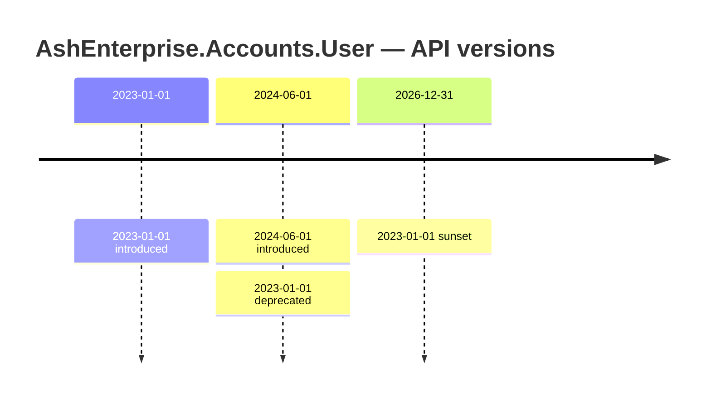

# Plan — AshApiVersioning

- **Status:** **PROPOSED.** Nothing here is built.
- **Date:** 2026-08-18
- **Scope:** an extension of the `ash_enterprise` platform, developed as a separate package alongside
  `ash_strangler` and `ash_bpmn`.
- **Companion:** [ADR 0019](../adr/0019-api-versioning-as-presentation-contract.md) — the decision; this is the specification.
- **Depends on:** [ADR 0008](../adr/0008-typed-invertible-legacy-mappings.md) for the invertibility machinery it borrows.

---

## 1. The problem, and the shape of the answer

An API is a promise made to somebody who does not deploy when you do. The schema behind it is not a promise; it is an
implementation. Versioning exists because the two change at different speeds, and every real system eventually
confuses them — usually by copying a resource, a schema, or a whole service so that "v1" and "v2" can diverge
physically.

That copy is the cost: two migrations, two policy sets, two audit paths, and a permanent question about which is
true. It is also unnecessary for the overwhelming majority of version deltas, which are **presentational** — a field
renamed, an enum spelled differently, two columns joined into a string, a field no longer exposed. None of those are
schema changes. They are rendering decisions a previous version of the documentation wrote down.

**One resource, one schema, N presentation contracts.** The extension declares version deltas as data on the
resource, the same way `ash_strangler` declares legacy mappings, and derives the render path, the parse path, the
deprecation headers, the telemetry, the report and the sunset evidence from that one declaration. It is
[thesis 1](../manifesto/01-model-your-domain.md) applied one layer out from the database: state the delta once, derive
the consequences, and make it impossible for the consequences to disagree.

**What it must never do is create a second schema, table, view or trigger.** That is not a simplification, it is the
whole boundary. A version delta that genuinely needs a second physical shape is not a presentation contract, and the
right tool for it is `ash_strangler` — which already has views, `INSTEAD OF` triggers, backfill and a phase model, and
paid for them. The value of this extension is precisely that it costs no migration. If it grows one, it has become a
worse `ash_strangler` and should be deleted. §8 states that as a testable requirement rather than an aspiration.

**Who this is for:** teams with an external contract they cannot break on their own schedule — a public API, a partner
integration, a mobile client with a long tail of un-upgraded installs — on the resource-derived surfaces
(`AshJsonApi`, `AshGraphql`), where the schema *is* the contract by default and there is no seam between them today.

**Who this is not for:** internal calls where both sides deploy together, and anyone whose "version 2" is a different
domain model rather than a different rendering of the same one. That is a rewrite, and versioning does not make it
survivable.

## 2. The single hardest question, answered first

The sketch this specification was commissioned from reads, in part:

```elixir
version "v1", introduced: ~D[2023-01-01] do
  field :full_name, from: [:first_name, :last_name],
    render: &Renderers.join_name/1, parse: &Renderers.split_name/1
  field :status, render: &Renderers.status_to_bool/1, parse: &Renderers.bool_to_status/1
end
```

**Both of those mappings must be refused, and the DSL as sketched cannot refuse either.** That is the finding this
section exists to record, and it changes the DSL rather than being worked around inside it.

### 2.1 What a bare capture can be checked for, exhaustively

`&Renderers.join_name/1` arrives in a Spark entity as a module, function and arity. Everything a compile-time
verifier can learn from it:

| Checkable | How | Worth |
|---|---|---|
| The function exists and has arity 1 | `Code.ensure_compiled/1` + `function_exported?/3` in a verifier | catches typos |
| A `parse:` is present wherever `render:` is, on a version serving a writable action | shape check over the entity | catches omissions |
| Argument and return types are consistent | Dialyzer, if specs are written | catches `String.t` vs `atom` |
| **`parse(render(x)) == x`** | — | **not checkable** |

The last row is the only one that matters, and it is not a matter of effort. Deciding whether two BEAM functions
compose to the identity is program equivalence — undecidable in general, with no restricted-enough subset of Elixir a
verifier could recognise from an MFA.

So the sketch's guarantee is **presence**, not invertibility: exactly the guarantee ADR 0008 measured and rejected.
Both directions present, both well-formed, both accepted by a shape check, and a single `UPDATE` through the resulting
view rewriting three of five lifecycle states with no error and a correct row count. A capture is in one respect worse
than the SQL string ADR 0008 was arguing against — a string can at least be read, so lineage can be guessed at.

### 2.2 The two sketched mappings, and why each is refused

**`status → boolean` is not injective, and the compiler can see that without seeing inside the function.** The
resource says what the domain is:

```elixir
attribute :status, :atom,
  public?: true,
  constraints: [one_of: [:active, :invited, :suspended, :closed]]
```

Four values rendering into two. Whatever `bool_to_status/1` does, three of the four inputs have no distinct image,
so `parse ∘ render` is the identity on at most two of them. This is not a bug in the renderer — it is the shape of
the mapping — and it is decidable at compile time by **finite-domain enumeration** over the attribute's own
`one_of`, which is ADR 0008's method and is *easier* here than there: the domain is declared in the same file, not
introspected out of somebody else's database.

**`full_name` from `first_name, last_name` is not decomposable at all.** ADR 0008 states the case and the reason in
one line, and the reason does not improve for being at the HTTP layer instead of the SQL layer: *"'de la Cruz'
splits wrong, and there is no rule that fixes it."*

### 2.3 So the DSL changes: a closed grammar in the invertible position

Following ADR 0008's second commitment — *grammar, not analysis* — the extension does not accept a transform and try
to invert it. It accepts constructors and **emits** both directions from them. Three tiers, named to match ADR 0008
so an engineer moving between the two packages is not learning two vocabularies:

| Tier | Constructors | Guarantee | Writable |
|---|---|---|---|
| 1 — total bijections | `rename`, `decode`, `affine`, `format` (with a lossless codec) | derived and proven by enumeration over the attribute's constraints | yes |
| 2 — partial isomorphisms | `constant`, `omit` (with a supplied write value) | needs exactly one declared datum; the loss is recorded | yes |
| 3 — opaque | `join`, `project`, `custom` | none | **no** — `read_only?: true` and `because:` are mandatory |

`join` is in tier 3 permanently and deliberately. A separator plus a `split_at:` rule makes `parse` *total*, which is
not the same as making it *correct*, and the difference is invisible until somebody with two surnames updates their
profile. There is no `on_ambiguity:` option that fixes this, so the DSL does not offer one.

The v1 example, rewritten so that it compiles:

```elixir
api_versions do
  version "2023-01-01" do
    introduced ~D[2023-01-01]

    # Tier 3. Rendered, never parsed. A v1 write naming `full_name` is rejected
    # with 422 quoting `because:` verbatim, which is why it is mandatory.
    join :full_name, from: [:first_name, :last_name], separator: " ",
      read_only?: true,
      because: "Not decomposable: 'de la Cruz' splits wrong, and there is no rule that fixes it."

    # Tier 3 again: four states into two booleans has no right inverse. Refused
    # as `decode`; permitted here only because it is declared lossy.
    project :active, from: :status, render: {:member_of, [:active]},
      read_only?: true,
      because: "A boolean cannot distinguish invited, suspended and closed. " <>
               "Writes must use the 2024-06-01 contract's `status`."

    # Tier 1. Both directions from one map; injectivity and exhaustiveness against
    # `one_of` checked by enumeration. `because:` is *forbidden* here, because the
    # compiler already knows the fact.
    decode :state, from: :status, %{
      active:    "ACTIVE",
      invited:   "PENDING",
      suspended: "LOCKED",
      closed:    "CLOSED"
    }

    omit :organization_id,
      because: "Tenancy was implicit in the v1 contract; the tenant is the API key."
  end
end
```

Three of the four mappings are refused a write path, and each says why in text a client sees. That is a less
convenient DSL than the sketch and it is the only version of it that means anything.

### 2.4 Where the guarantee genuinely runs out, and the fallback

`ash_strangler` has an escape from undecidability: when an obligation cannot be decided at compile time it is
re-emitted as SQL and `mix ash_strangler.check` runs it against the legacy rows. **There is no corresponding data set
here.** The value space that matters for the parse direction is *whatever clients send*, which is unbounded, not
under your control, frequently not what your documentation described, and — where you do have a record of it in
request logs — often PII you should not be feeding into a test harness.

So the obligation that matters most inverts. In `ash_strangler` the sharp one is `PutGet` over the legacy value
space, because that space contains rows the tool did not create. Here:

- `GetPut` — `parse(render(x)) == x` for `x` drawn from the **resource's** value space — is decidable for tier 1 by
  enumeration, and is what the compiler proves.
- `PutGet` — `render(parse(y)) == y` for `y` drawn from the **client's** value space — is not decidable, not
  measurable, and not enumerable. It is the direction an old client actually exercises.

The fallback is therefore weaker than `ash_strangler`'s and must be described as weaker: `mix ash_api_versioning.check`
generates round-trip properties with `StreamData` over `Ash.Generator` output for every writable mapping of every
live version, and a tier 3 `custom` mapping (see §8's escape hatch) cannot be declared without one. That finds what
the generator can produce. It does not find what curl can produce, and the README must say so in those words rather
than calling it verification.

**The honest summary: compile-time invertibility is real for tier 1, structurally unavailable for tier 3, and the
design's contribution is making the boundary between them a compile error instead of a code review.**

## 3. The DSL

### 3.1 The entities, as Spark would express them

```elixir
defmodule AshApiVersioning.Resource do
  # The transform entities all target `AshApiVersioning.Transform.*` structs.
  # `@decode` takes `as`, `from` and a required `mapping: [type: :map]`, total and
  # injective over the attribute's `one_of`; `@rename` and `@constant` the same
  # without the map. `@join`, `@project` and `@custom` add
  # `read_only?: [type: :boolean, required: true]` and
  # `because: [type: :string, required: true]` — tier 3 has no inverse, so both are
  # structural rather than advisory. `@omit` takes `field`, a mandatory `because:`,
  # and an optional `on_write:` supplying the value a writable action needs (§9.12, property 3).

  @version %Spark.Dsl.Entity{
    name: :version,
    target: AshApiVersioning.Version,
    args: [:identifier],
    entities: [transforms: [@rename, @decode, @join, @project, @constant, @custom, @omit]],
    schema: [
      identifier: [type: :string, required: true],
      introduced: [type: {:struct, Date}, required: true],
      phase: [type: {:one_of, [:active, :deprecated, :sunset_eligible, :retired]}, default: :active],
      deprecated_on: [type: {:struct, Date}, doc: "Required once `phase` leaves `:active`. Emitted as `Deprecation`."],
      sunset_after: [type: {:struct, Date}, doc: "Emitted as `Sunset`. RFC 9745 forbids it preceding `deprecated_on`."],
      successor: [type: :string, doc: "Identifier of the version clients should move to."],
      documentation: [type: :string, doc: "URL quoted in the deprecation `Link` header."]
    ]
  }

  @api_versions %Spark.Dsl.Section{
    name: :api_versions,
    entities: [@version],
    schema: [
      default: [type: :string, doc: "Version served when a request names none. See §9.5 — this is a liability."],
      on_unspecified: [type: {:one_of, [:default, :reject]}, default: :reject]
    ]
  }

  use Spark.Dsl.Extension,
    sections: [@api_versions],
    verifiers: [
      AshApiVersioning.Verifiers.VerifyFieldsResolve,
      AshApiVersioning.Verifiers.VerifyWritableInvertible,
      AshApiVersioning.Verifiers.VerifyOmissionsComplete,
      AshApiVersioning.Verifiers.VerifyPhaseOrdering,
      AshApiVersioning.Verifiers.VerifyDefaultIsLive,
      AshApiVersioning.Verifiers.VerifyNoQueryOnOmitted
    ]
end
```

A version block declares **deltas only**, and that is enforced rather than encouraged: there is no way to write out a
full schema, and any field not named by a transform is presented as the current resource presents it. A version with
an empty body is the current shape under an older name — which is what `"2024-06-01"` in the sketch is, and why it
needs none.

### 3.2 What the DSL cannot express, stated plainly

- **A field that changed meaning without changing shape.** v1's `total` excluded tax; v2's includes it. Same name,
  same type, different promise. The delta is not in the data, so no transform describes it. That is a genuine second
  contract and belongs to `ash_strangler` or to a new attribute.
- **A structural reshape** — v1 nested `address` inline, v2 made it a relationship. The grammar is per-field over a
  flat attribute set; nesting is §9.2, out of scope for the alpha.
- **Cross-field invariants.** v1 allowed `discount` without `discount_reason`; v2 requires both. That is an action
  validation, and putting it here would put business rules in the presentation layer.
- **Anything conditional on the actor.** Field policies do that, and they are authorization — see §9.11 for why
  `omit` must never be reached for to hide a sensitive field.
- **Per-action versions.** A version is per resource, because a request carries one identifier and a document can
  contain several resources (§9.2).

## 4. Router and plug integration

Version resolution wraps the action; it never enters it. The Ash action, its policies, its changes and its audit
record are byte-identical whether the request arrived as v1 or v2, and that is the property that keeps a version from
becoming a fork.

```
conn
  |> AshApiVersioning.Plug.call([])        # resolve identifier -> %Version{}, or 400
  |> AshJsonApi.Router.call(opts)          # unchanged; params already parsed to current names
       -> Ash action                       # unchanged, entirely
  |> AshApiVersioning.Plug.render/2        # register_before_send: render + deprecation headers
```

`parse` runs on the request params before the router builds a changeset, so `AshPhoenix.Form`, policies and
validations see current attribute names and never learn that versions exist. `render` runs in a
`Plug.Conn.register_before_send/2` callback over the serialized document.

### 4.1 The three identifier strategies

| Strategy | Example | Verdict |
|---|---|---|
| **Path segment** | `GET /api/v1/users` | Works, and duplicates the route table. Every `self`/`related` link must be rewritten to stay inside `/v1`, or a client following a link leaves its own version mid-traversal. Caches correctly with no configuration — its real advantage. |
| **Request header** | `Api-Version: 2023-01-01` | **Recommended.** One route table, URIs stable, no link rewriting. Costs a mandatory `Vary:` (§9.10) and is invisible in a browser. |
| **Media type parameter** | `Accept: application/vnd.api+json; version=1` | **Unavailable for JSON:API, as a matter of spec.** Verified against JSON:API v1.1: *"The JSON:API media type MUST NOT be specified with any media type parameters other than `ext` and `profile`"*, and servers *"MUST respond with a `415 Unsupported Media Type` status code"* when a `Content-Type` carries any other. A conforming client may treat our `version` parameter as an error. |

The third row is a finding rather than a preference: content negotiation is the answer most often reached for on
first principles, and it is the one the specification forecloses. (https://jsonapi.org/format/1.1/, verified
2026-08-18.)

**Header name.** Not `X-Api-Version`. RFC 6648 (*Deprecating the "X-" Prefix and Similar Constructs in Application
Protocols*, June 2012, BCP 178) says creators of new parameters *"SHOULD NOT prefix their parameter names with 'X-'
or similar constructs"*. And there is **no registered field for requesting an API version** — verified against the
full IANA HTTP Field Name Registry, 259 entries as of 2026-08-18: no `API-Version`, `Accept-Version` or `Version`, and
neither `Stripe-Version` nor `X-GitHub-Api-Version` is registered. Every date-header scheme in the wild is a private
convention. The name is therefore application-specific and configurable; the extension defaults to `api-version` and
expects the host to namespace it.

**This design has no standards backing, and should not claim any.** The closest authoritative statement is
[RFC 9205](https://www.rfc-editor.org/rfc/rfc9205.html) (BCP 56, *Building Protocols with HTTP*, June 2022) §4.16,
which lists three ways to make backwards-incompatible changes: a distinct link relation type, a distinct media type,
or *"a distinct HTTP header field to implement new functionality outside the message content."* Note what is absent
from that list — a version number in the URI path, and a general-purpose API-version request header. Mark Nottingham,
who wrote it, argues against **both** of the strategies §4.1 shortlists: a version header is *"broken and wrong for a
whole mess of reasons"*, prominently that responses now vary on it (§9.10); path versioning is *"coarse-grained, in
that you can't evolve parts of the system independently"* and *"intermingling the version into identifiers"*
(mnot.net, 2012). The IETF-adjacent ideal is per-resource evolution via new media types and link relations, not a
global version identifier at all.

So the recommendation here is **pragmatism over the RFC 9205 ideal**, chosen because Stripe and GitHub have run it at
scale for a decade and because a global identifier is what a `version` block in a DSL can actually derive. That is a
defensible trade and it is not standards conformance. (Note also that RFC 8820, *URI Design and Ownership*, is
sometimes cited against `/v1/` and does **not** apply: it constrains specification authors, and explicitly exempts
prefixes under the deploying party's own control.)

Path and header are not exclusive, which is worth knowing before choosing. Stripe keeps `/v1/` as a stable namespace
that has never changed, and negotiates the actual version entirely through `Stripe-Version` and per-account pinning.

**Version identifiers are dates, not integers.** `"2023-01-01"`, not `"v1"`. Stripe's current version is
`2026-07-29.dahlia` — a date plus a release-train name, where the date orders and the name groups; GitHub's
`X-GitHub-Api-Version: 2026-03-10` is a bare date. Beyond matching both, it earns its keep internally: `introduced` is a date, `sunset_after` is a date, and the §6 report is a timeline. An
integer needs a lookup table to say when it existed; a date is its own ordering. `"v1"` is still accepted as an opaque
string, so existing URLs are not blocked, but the generator and the docs use dates.

### 4.2 When no version is supplied

`on_unspecified` defaults to `:reject` — 400 naming the header and listing the live versions. Deliberately the
unfriendly option, because the alternatives are worse in ways that only surface later. *Serve the newest*: every
release breaks every unversioned client, which is versioning that does not version. *Serve the oldest*: it can never
be retired, because a client that wants it is indistinguishable from one that forgot to ask. *Serve `default:`*: the
same problem wearing a configuration option (§9.5).

Where `:default` is configured anyway, two things are mandatory, both to keep §7's arithmetic honest. Telemetry
records `resolution: :unspecified` distinctly from `resolution: :header` — **defaulted traffic is never counted as
deliberate traffic for the version it landed on** — and the response says the version was assumed, so the fact is
visible to whoever is debugging the client rather than only to us.

A fourth source sits between header and default, and it is what makes `:reject` survivable for a public API: **the
actor.** Stripe pins an account to the version current at its first request; here that is `actor.api_version`, read
from the actor the host already has and costing the extension no storage of its own (§8). Resolution order is
**header → actor pin → default → reject**, and a pinned actor never sees a 400.

## 5. Deprecation, and the lifecycle phases

Four phases, mirroring `ash_strangler`'s phase model, with the same property that one word in the DSL decides which
artifacts exist:

| | `:active` | `:deprecated` | `:sunset_eligible` | `:retired` |
|---|---|---|---|---|
| Served | yes | yes | yes | **no** — 410 Gone naming the successor, as GitHub does for a removed version |
| Response headers | none | `Deprecation`, `Sunset`, `Link … rel="deprecation"` | same | — |
| Declared or derived | declared | declared | **derived** from traffic (§7) | declared |
| Compile-time constraint on the resource | full | full | full | none — the block is deleted |
| Rollback | — | remove the phase | remove the phase | **none.** The one-way door |

This is expand/contract applied to API surface, exactly: `:active` on version N+1 while N still serves is *expand*,
clients moving is *migrate*, deleting the version block is *contract*. It fails in the same place too — contract
stalls because nobody can prove the old path is dead — which is why §4's telemetry is a requirement rather than an
add-on. It plays the role `ash_strangler`'s in-trigger usage counter plays, with one advantage: the strangler's
counter does not exist on the `writes: :auto` path, so its evidence is missing exactly where triggers were avoided.
A plug always runs. There is no blind spot.

`:sunset_eligible` is the only phase that is not a declaration. It is a fact about traffic, so nothing may set it
except a human accepting a §7 proposal — at which point the diff is reviewable, which is the point of putting it in
the DSL at all rather than leaving it in a dashboard.

```elixir
version "2023-01-01" do
  introduced ~D[2023-01-01]
  phase :deprecated
  deprecated_on ~D[2024-06-01]
  sunset_after ~D[2026-12-31]
  successor "2024-06-01"
  documentation "https://developer.example.com/api/migrating-to-2024-06-01"
end
```

### 5.1 The headers, and their specifications

Both header fields are specified, and they are **not** at the same level of maturity or in the same date encoding.
Verified 2026-08-18 against the primary documents:

| Field | Specification | Status | Value syntax |
|---|---|---|---|
| `Deprecation` | [RFC 9745](https://www.rfc-editor.org/rfc/rfc9745.html), *The Deprecation HTTP Response Header Field*, March 2025 | **Standards Track** | Structured Field **Item** holding a Date ([RFC 9651](https://www.rfc-editor.org/rfc/rfc9651.html) §3.3.7) — a Unix timestamp with an `@` sigil |
| `Sunset` | [RFC 8594](https://www.rfc-editor.org/rfc/rfc8594.html), *The Sunset HTTP Header Field*, May 2019 | Informational | a single **HTTP-date** (RFC 7231 §7.1.1.1) |

```http
Deprecation: @1717200000
Sunset: Tue, 31 Dec 2026 23:59:59 GMT
Link: <https://developer.example.com/api/migrating-to-2024-06-01>; rel="deprecation"
```

**Two adjacent headers stating the same kind of fact in two different serializations is precisely the sort of thing a
generator should own.** Hand-written middleware formats one of them with the other's rule, and the failure is a
header a client parses to the wrong instant or discards — visible to nobody on our side. Both dates come from one
`version` block here, so the two encodings are applied once, in one module, and tested once.

**The deployed world has not caught up, and a generator has to pick a side.** GitHub emits both fields today and
documents `Deprecation` as *"formatted as an HTTP date per RFC 7231"* — the pre-ratification draft syntax, not
RFC 9745's structured Date. So a client library written against a real API may well expect
`Wed, 27 Nov 2019 14:34:29 GMT` where a conforming server sends `@1574865269`. The extension emits the RFC, because
the RFC is Standards Track and guessing at a census of client parsers is not a design principle, but the option to
emit the legacy form must exist and must be named for what it is rather than presented as a format choice.

RFC 9745 defines the `deprecation` link relation for the migration document; RFC 8594 separately defines a `sunset`
relation for a retirement-policy resource. The extension emits the former from `documentation` and leaves the latter
to the host, which is the only one of the two that knows whether such a policy page exists.

**RFC 9745 imposes one normative constraint the extension can check rather than document:** *"The timestamp given in
the `Sunset` HTTP header field MUST NOT be earlier than the one given in the `Deprecation` header field."* Because
both dates are declared in the same block, `VerifyPhaseOrdering` decides it at compile time instead of leaving it to
be discovered by a client. Its companion obligation is that `deprecated_on` is **required** once `phase` leaves
`:active` — the phase is a lifecycle fact and the header needs an instant, and reading a date off "when somebody
edited the file" is not a date at all.

RFC 8594's own framing matches the phase model directly, which is the reason to follow it rather than invent one:
*"For the second stage (the API or a specific version of the API gets decommissioned), the Sunset header field is
appropriate: that is when the API or a version does become unresponsive."* Deprecation is the announcement; sunset is
the shutdown; `:retired` is after it.

**A `sunset_after` in the past does not retire a version.** Retirement is a code change, reviewed and deployed. A
date arriving does not delete anything, because a header is a promise about intent and an outage is not something a
calendar should be able to cause on its own. `VerifyPhaseOrdering` checks that `sunset_after` follows `introduced` and
`deprecated_on`, that `deprecated_on` is present once the phase leaves `:active`, and that `successor` names a live
version. It does **not** check whether any date has passed, for the reason in §9.8.

## 6. The generated report

```
mix ash_api_versioning.gen.report              # writes docs/api-versions.md
mix ash_api_versioning.gen.report --check      # CI gate; non-zero if the committed file is stale
mix ash_api_versioning.gen.report --traffic    # adds usage columns; never committed
```

Same non-negotiable as `mix ash_strangler.gen.diagram`: generated from the declaration, never hand-drawn, so it
cannot drift. Hand-maintained version documentation is wrong within one release and stays wrong, because the only
thing that would correct it is somebody noticing.

**The report is two documents, and the split is forced rather than stylistic.** The declaration report is
deterministic — resources, versions, phases, dates, successors, field deltas — so it is committable and
`--check`-able. The traffic report is not; a `--check` over a file containing last-90-days request counts can never
pass. Merging them yields a document that either cannot be gated or cannot be trusted, so `--traffic` prints to
stdout and is never committed.



A Mermaid `gantt` was the first instinct and does not work: a gantt bar needs an end date and an active version has
none, so every current version renders as a bar to an invented date that readers will take literally. `timeline` has
no duration concept and is honest about it.

## 7. Sunset proposals

A nightly `mix ash_api_versioning.check --sunset` compares traffic against a threshold and emits proposals:

```
PROPOSAL  AshEnterprise.Accounts.User  version 2023-01-01
  sunset_after   2026-12-31  (passed 229 days ago)
  window         90 days
  requests       41          (threshold: 100/day)
  distinct actors 1          (threshold: 0)
  last seen      2026-05-02  by actor 6b1e8b2c-…
  BLOCKED: one actor is still using this version. Contact them before proposing retirement.
```

**Distinct consumers, not requests, is the number that decides.** One partner calling once a quarter is a blocker;
ten thousand requests a day from a load test you own is not. A request-rate threshold alone retires versions that are
still in use by exactly the clients least able to notice.

The proposal is never executed automatically, following the pattern `AshEnterprise.AI.Proposal` establishes: the agent
plans, the human approves, the application executes. The borrowing is of the *pattern*, not the *module*, and the
difference matters. `AshEnterprise.AI.Proposal.execute/2` runs an Ash action with the approving human as the actor,
which is what makes the audit entry truthful. **A version retirement is not an Ash action — it is a code change**,
deleting a DSL block, so its "execution" is a pull request and nothing in the running system may apply it. A console
that edits and deploys source in response to a click is a remote code execution path with a confirmation dialog in
front of it, and the dialog is not the security control it looks like.

The proposal therefore carries evidence and a unified diff deleting the version block — an
`%AshApiVersioning.Proposal{kind: :retire_version, resource:, version:, evidence:, patch:}` — and the approval step
is a human opening the PR.

## 8. Non-functional requirements

**No new database objects.** No migrations, no views, no triggers, no tables. This is the property that makes the
extension categorically cheaper than `ash_strangler`, and without it the extension is `ash_strangler` with extra
syntax. It is testable rather than aspirational: the package's own suite asserts that installing the extension into a
resource and running `mix ash.codegen --check` produces **no** pending migration, and that assertion is the one that
must never be relaxed.

It also has a consequence people will try to violate from the other end. §7's proposals need traffic history, and
traffic history wants a table. So the extension **emits** telemetry and **reads** through a behaviour:

```elixir
defmodule AshApiVersioning.UsageSource do
  @callback usage(resource :: module(), version :: String.t(), window :: pos_integer()) ::
              {:ok, %{requests: non_neg_integer(), distinct_actors: non_neg_integer(), last_seen: Date.t() | nil}}
              | {:error, term()}
end
```

The host points that at Prometheus, at its OpenTelemetry backend, or at an ordinary Ash resource it declares and
therefore owns the migration for. The extension ships none.

**Telemetry is emitted by default, not configured on.** Inherited from the pattern in
[thesis 4](../manifesto/04-batteries-are-inherited.md) — the measure is not that observability is possible, it is
that forgetting it requires effort. Every resolved request emits:

```elixir
:telemetry.execute([:ash_api_versioning, :request, :stop], %{duration: duration},
  %{resource: resource, action: action, version: "2023-01-01",
    resolution: :header, phase: :deprecated, actor_id: actor_id})
```

No payload, no params, no rendered document: metadata only, because a telemetry handler carrying request bodies is a
PII leak into the metrics backend, and metrics backends are not where PII is governed.

**Composable with `AshJsonApi` and `AshGraphql`.** Version resolution wraps serialization, never replaces it. Those
extensions already derive the bulk of schema-to-JSON, and reimplementing any of it here produces a second serializer
that disagrees with the first about exactly the cases nobody tested.

**The escape hatch to `ash_strangler` is a specific error, not a doc page.** When a version delta cannot be expressed
— a genuinely deleted attribute, a changed meaning, a structural reshape — the compiler must name the tool rather
than leave an engineer to discover the boundary by trying things:

```
** (Spark.Error.DslError) [AshEnterprise.Accounts.User]
 api_versions -> version 2023-01-01 -> rename:

  `rename :fax_number, from: :fax_number` refers to an attribute that no longer
  exists on this resource.

  A version block is a *presentation* of the current schema. It can rename,
  re-encode and omit; it cannot resurrect. The three ways out, in order of
  preference:

    1. Retire version "2023-01-01" first, then delete the attribute.
    2. Keep the attribute and `omit` it from later versions.
    3. If v1 and the current model are genuinely different shapes rather than
       different renderings, this is not an API versioning problem. Model the
       prior schema as its own resource and map between them with
       `ash_strangler` — see docs/plans/ash-strangler.md §5.
```

**Alpha scope is REST/JSON:API dispatch only.** GraphQL field deprecation is deferred, and §9.11 says why that is a
different problem rather than a smaller one.

## 9. What is genuinely hard

Twelve things. Four are unresolved and would ship as documented limitations.

### 9.1 The residual after §2

Tier 1 is proven; tier 3 is refused a write path; the gap is real work that is now *visible*. What remains
unresolved is `PutGet` over the client value space (§2.4) — undecidable, unmeasurable, and the direction old clients
actually exercise. Generated property tests are the fallback and they are weaker than `ash_strangler`'s
run-it-against-the-legacy-rows, because there are no rows.

### 9.2 Relationships, includes, and whose version an included resource speaks

A request carries **one** version identifier; a JSON:API document carries **many** resources. `GET /users/1?include=team`
under `User` v1 returns a `Team` in `included`. Which contract does that `Team` render under?

Neither answer is good. Render the current shape and one document holds two contracts with nothing marking the
boundary. Require every resource reachable by `include` to declare a matching version and one omission turns an
unrelated resource's edit into a compile error across the graph. The likely landing is per-resource resolution with a
declared fallback (`missing_version: :current | :reject`, defaulting to `:reject`), and this is a substantial part of
why the alpha's `include` support is limited. **Unresolved.**

Renaming a relationship is worse still: it must be rewritten in `include=`, in the `relationships` object's keys, in
`links.related`, and in the `type` of every resource identifier object pointing at it. Out of scope for the alpha.

### 9.3 Filters and sorts naming a field the version invented

`filter[full_name]=Ana` under v1 asks for a filter over a field that does not exist. A value-level `parse` cannot
express it: the transform maps *values*, and this needs a *query* rewritten across two attributes. `sort=full_name`
is worse — sorting by a concatenated string is genuinely not the same ordering as `sort=last_name,first_name`, and no
rewrite makes it so.

The rule: **a tier 3 field is not queryable.** `VerifyNoQueryOnOmitted` covers the omission case at compile time; the
plug rejects filter and sort parameters naming tier 3 or omitted fields at runtime with 400 and the field name. This
is a real reduction in what v1 could do — and it is what v1 could *correctly* do all along.

### 9.4 Pagination cursors encode a shape

AshJsonApi keyset cursors encode the sort keys. A cursor minted under one version and replayed under another decodes
to keys that may no longer exist, and cursors are opaque to clients, so clients hold them across a version switch
without knowing they did.

The rule that follows is cheap and must be stated before anyone writes the code: **cursors are never transformed.**
They always encode current attribute names, they are never rendered through a version's field mappings, and a cursor
is therefore portable across versions by construction. The alternative — tagging cursors with a version and rejecting
cross-version replay — is more code and a worse experience for an invariant that costs nothing to keep.

### 9.5 `default:` may not be a safe concept

The task for a default version is impossible as stated: identify what an unversioned client wants. It cannot, because
an unversioned client did not say.

Everything downstream degrades from that. Defaulted traffic cannot be attributed, so it cannot be used as sunset
evidence (§4.2), so a resource whose traffic is mostly unspecified **can never retire anything**. And retiring the
version that `default:` names breaks every unversioned client simultaneously — the precise failure versioning exists
to prevent, caused by the versioning system. `VerifyDefaultIsLive` can at least refuse a `default:` naming a
`:retired` version, which catches the crude form and none of the interesting one.

GitHub is the worked example: *"Requests without the `X-GitHub-Api-Version` header will default to use the
2022-11-28 version."* That version has been the default since 2022 and is a permanent floor for exactly the reason
above — the traffic on it cannot be attributed, so it cannot be shown to be safe to remove.

The position taken here is that `on_unspecified: :reject` is the default and `:default` is an opt-in with its cost
documented on the option. Whether `default:` should exist at all is **undecided**, and the honest test is whether any
adopter can operate without it.

### 9.6 A deleted attribute, and the direction of the constraint

Renames are easy and deletions are not. v1 promised `fax_number`; the column is gone. The options are to lie with a
constant, to break a frozen contract, or to refuse.

Refusing is right, and it exposes the real cost of versioning, which is usually left implicit: **a live version block
constrains the current schema.** You may not delete an attribute any live version reads. The dependency runs
backwards from the direction people assume — the old contract limits the new model, not the other way round — and
this is what the "don't version at all" camp is actually objecting to.

Making it a compile error naming the version is, after §2's invertibility check, the second most valuable property in
the design, because the alternative is discovering it when a v1 client gets a 500 in production.

### 9.7 Error documents have shapes too

JSON:API errors carry `source.pointer` — `/data/attributes/full_name`. Under v1 those pointers must name v1 fields,
so the render path has to cover the error document and not just the success document. Two cases have no answer:

- A validation error on `first_name`, which v1 has never heard of. There is no valid v1 pointer. The pointer must be
  dropped and the error rendered without a source, which degrades a machine-readable error into a string.
- Ash error *messages* embed attribute names in prose. Rewriting prose is out of the question, so v1 clients see
  current field names inside message text while pointers say otherwise.

Usually skipped by hand-rolled versioning layers, and it is where the seams show first. **Unresolved.**

### 9.8 A compile-time check against "now" breaks the build on a date boundary

The tempting verifier — refuse `phase :sunset_eligible` before `sunset_after` has passed — makes compilation depend
on `Date.utc_today()`. A build that passes today fails tomorrow with no commit, and CI on a long-running branch fails
for reasons no diff explains. Worse, the reverse also holds: a build cached before the boundary and a build after it
disagree about whether the same source compiles.

So every date comparison is at **runtime** — in the plug, in the mix task, in the report. Verifiers check only
orderings between declared dates, which are facts about the source.

### 9.9 Traffic below a threshold is not evidence of absence

A client that has not called in 90 days may be quarterly, may be annual, may be a disaster-recovery path that runs
when something else is already on fire. `ash_strangler`'s equivalent is better positioned — its counter sits in the
database and sees every write — while here a client that does not call is simply invisible, and invisibility is what
the measurement is trying to distinguish.

Mitigations, none complete: measure distinct actors rather than requests (§7); require the window to exceed the
longest known client cadence and make that a configured number somebody has to type; and treat the proposal as the
start of a conversation with a named partner rather than as a decision.

### 9.10 Header dispatch requires `Vary`, and `Vary` on a custom header is poorly served

If the version arrives in a header, every response must carry `Vary: api-version` or a shared cache serves one
client's rendering to another. This is a correctness requirement, not a performance note, and it is the strongest
argument for the path-segment strategy §4.1 does not recommend — and it is the first objection Nottingham raises
against version headers, sardonically, as `Vary: BadAPIVersion`.

It is also imperfectly honoured: CDNs vary reliably on a small set of well-known headers, and handling of arbitrary
ones ranges from "configure it explicitly" to "silently ignored". The extension can set the header; it cannot make an
intermediary respect it. Teams behind a CDN they do not control should use path segments, and the documentation must
say so where the strategy is chosen, not in a troubleshooting appendix.

### 9.11 GraphQL, and the position that you should not version at all

The GraphQL project states the position directly (https://graphql.org/learn/schema-design/, verified 2026-08-18):
*"While there's nothing that prevents a GraphQL service from being versioned just like any other API, GraphQL takes a
strong opinion on avoiding versioning by providing the tools for the continuous evolution of a GraphQL schema."* And
the reason, which is precisely a diagnosis of REST: *"When there's limited control over the data that's returned from
an API endpoint, any change can be considered a breaking change, and breaking changes require a new version… In
contrast, GraphQL only returns the data that's explicitly requested, so new capabilities can be added via new types
or new fields on existing types without creating a breaking change."*

That position is largely correct **for GraphQL** and is not transferable. A REST body is not chosen by the client; the
server decides what a `user` looks like, so adding a field is observable and renaming one is breaking. The honest
conclusion is not "version both" but "version REST, deprecate fields in GraphQL" — the same resource carrying two
change disciplines derived from one schema. Deferring GraphQL is therefore not a scope cut to be made up later; it is
recognition that `@deprecated` plus per-field usage telemetry is a *different feature*, and one this extension's §4
telemetry is already most of the input for.

The GraphQL spec moved recently in a way that matters for whoever picks this up. The ratified **September 2025**
edition extends `@deprecated` from `FIELD_DEFINITION | ENUM_VALUE` to
`FIELD_DEFINITION | ARGUMENT_DEFINITION | INPUT_FIELD_DEFINITION | ENUM_VALUE`, so deprecating an *input* is now
spec-supported rather than a draft — which is most of what a GraphQL deprecation story here would need. It comes with
a rule worth knowing before building on it: *"The @deprecated directive must not appear on required (non-null without
a default) arguments or input object field definitions"*, so making an input optional is a prerequisite step, not an
afterthought.

One consequence must be stated before somebody assumes otherwise. **`omit` is presentation, not authorization.** A
field omitted from v1 is still readable through the current version, through GraphQL, through `include`, and — but
for §9.3's rule — inferable through a filter, which turns an omitted field into a binary-search oracle over its
value. Field policies hide fields. `omit` renders them absent. Confusing the two is a disclosure bug, and the
`because:` on `omit` is one place a reviewer might catch someone about to make it.

### 9.12 It might be a plug

Stated last, and it must survive the preceding eleven sections in the way `ash-strangler.md` §10.11 does.

Strip the extension to what is load-bearing and it is: a resolver, a render/parse pass, some headers, and a telemetry
event. All of that is a Plug and a couple of hundred lines, and any competent team writes it in an afternoon without a
DSL.

What the DSL adds is the three compile-time properties, and they are the whole argument:

1. A live version's fields must be derivable from the current resource — so deleting an attribute a version promises
   is a compile error rather than a 500 (§9.6).
2. A writable mapping must be invertible by construction — so the four-states-into-a-boolean collapse ADR 0008
   measured cannot reach production looking correct (§2).
3. An omitted attribute a writable action requires must supply a value — so v1 cannot silently lose the ability to
   create records.

None of the three is available to a hand-written plug at any price, because none of them is a runtime check. If those
three do not survive contact with a real API, the correct outcome is to ship the plug and delete the DSL — and
pre-committing to that here is the reason this document exists before any code.

## 10. Sequencing

| Step | Deliverable | Why this order |
|---|---|---|
| 1 | The DSL, `Info`, and the three verifiers — no plug, no rendering | Standalone value, zero runtime risk, and it is the decision gate for §9.12 |
| 2 | Tier 1 grammar + `mix ash_api_versioning.check` round-trip properties | The oracle before the thing it checks, as `ash-strangler.md` §11 step 3 |
| 3 | Resolver and plug, header strategy, `:reject` only | The smallest useful runtime |
| 4 | Render/parse over JSON:API documents, tier 3 read-only path | The risky part, with the oracle already in place |
| 5 | Deprecation/Sunset headers and telemetry | Independent; useful on its own |
| 6 | `gen.report` (declaration only) | Deterministic half first |
| 7 | `UsageSource`, `--traffic`, sunset proposals | Needs step 5 to have been running long enough to have data |
| 8 | Path-segment strategy, actor pinning | Both are alternatives to decisions step 3 made; defer until one is asked for |

**Step 1 is the decision gate.** If the three verifiers are useful on their own and steps 3–4 look worse in the
writing than they do here, ship step 1 plus a guide to hand-rolling the plug and stop. That is a legitimate outcome.
